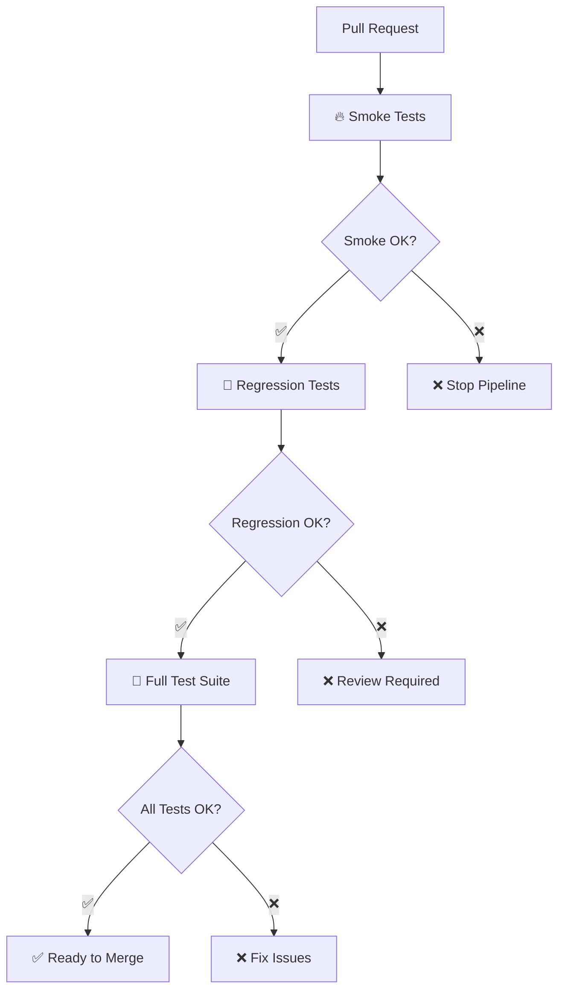

# 🚀 CI/CD для автоматизированного тестирования

## 📋 Обзор workflows

Созданы три GitHub Actions workflow для комплексного тестирования:

### 🧪 `tests.yml` - Основной workflow для Pull Requests
**Триггеры**: Pull Request, Push в main
**Цель**: Полная проверка изменений перед слиянием

### 🌙 `nightly.yml` - Ночные тесты  
**Триггеры**: Cron (2:00 UTC), Ручной запуск
**Цель**: Полное тестирование на всех браузерах и окружениях

### ⚡ `quick-check.yml` - Быстрая проверка
**Триггеры**: Push в main/develop при изменении кода тестов
**Цель**: Моментальная проверка критического функционала

## 🎯 Стратегия тестирования

### Этап 1: Smoke Tests (🔥)
```yaml
Duration: ~10 секунд
Tests: 9 критических тестов
Browser: Chromium только
Purpose: Быстрая проверка основного функционала
```

### Этап 2: Regression Tests (🔄)  
```yaml
Duration: ~30 минут
Tests: 39 регрессионных тестов
Browsers: Chromium, Firefox, WebKit
Purpose: Полная проверка всех функций
```

### Этап 3: Full Test Suite (🎯)
```yaml
Duration: ~45 минут  
Tests: Все 65 тестов
Browsers: Все поддерживаемые
Purpose: Финальная проверка перед merge
```

## 📊 Workflow схема



## 🛠️ Конфигурация файлов

### `.github/workflows/tests.yml`
```yaml
# Основной файл для PR тестирования
- Smoke Tests: 9 тестов, ~10 сек
- Regression Tests: 39 тестов на 3 браузерах
- Full Suite: 65 тестов с Allure отчетами
- Артефакты: скриншоты при ошибках
```

### `.github/workflows/nightly.yml`
```yaml
# Ночное полное тестирование
- Schedule: Каждую ночь в 2:00 UTC
- Matrix: 3 браузера × 2 окружения = 6 конфигураций
- Retention: 30 дней для артефактов
```

### `.github/workflows/quick-check.yml`
```yaml
# Быстрая проверка изменений
- Trigger: Push в main/develop
- Duration: ~8 секунд
- Tests: Только smoke на Chromium
```

## 📦 Зависимости

### `requirements.txt`
```txt
pytest>=7.4.0           # Основной фреймворк
playwright>=1.40.0       # Браузерная автоматизация
pytest-playwright>=0.4.3 # Интеграция
faker>=19.0.0           # Генерация тестовых данных
allure-pytest>=2.13.2   # Отчеты
```

## 🚀 Команды для локальной разработки

### Быстрая проверка (как в CI)
```bash
# Локальная имитация smoke тестов
python -m pytest -m smoke --browser=chromium -v --tb=line --maxfail=1

# Локальная имитация regression тестов
python -m pytest -m regression --browser=chromium -v --tb=short
```

### Установка окружения как в CI
```bash
# Установка зависимостей
pip install -r requirements.txt

# Установка браузеров
playwright install chromium firefox webkit
```

## 📊 Мониторинг и отчеты

### GitHub Actions Dashboard
- ✅ Статус всех workflow
- 📊 Время выполнения тестов
- 📈 Тренды успешности
- 🔍 Логи выполнения

### Allure Reports
```bash
# Генерация локального отчета
python -m pytest --alluredir=allure-results
allure serve allure-results
```

### Артефакты при ошибках
- 📷 Скриншоты упавших тестов
- 🎥 Видеозаписи (если настроено)
- 📋 Подробные логи
- 📊 Allure результаты

## 🔧 Настройка в новом репозитории

### Шаг 1: Копирование файлов
```bash
# Скопировать структуру CI/CD
cp -r .github/ /path/to/new/repo/
cp requirements.txt /path/to/new/repo/
cp pytest.ini /path/to/new/repo/
```

### Шаг 2: Настройка GitHub
1. В Settings → Actions включить GitHub Actions
2. В Settings → Environments создать окружения dev/stage (опционально)
3. Проверить права доступа для workflow

### Шаг 3: Первый запуск
```bash
# Создать Pull Request для проверки
git checkout -b feature/test-ci
git commit --allow-empty -m "Test CI setup"
git push origin feature/test-ci
# Создать PR через GitHub UI
```

## 🎛️ Настройки workflow

### Таймауты
```yaml
timeout-minutes: 10   # Smoke tests
timeout-minutes: 30   # Regression tests  
timeout-minutes: 45   # Full test suite
timeout-minutes: 60   # Nightly tests
```

### Матричные стратегии
```yaml
strategy:
  fail-fast: false  # Продолжить даже при ошибке
  matrix:
    browser: [chromium, firefox, webkit]
    environment: [dev, stage]
```

### Условия запуска
```yaml
# Только для PR
if: github.event_name == 'pull_request'

# Всегда (даже при ошибках)
if: always()

# Только при успехе
if: success()
```

## 📈 Оптимизация производительности

### Кэширование
```yaml
- uses: actions/setup-python@v4
  with:
    cache: 'pip'  # Кэш pip зависимостей
```

### Параллельное выполнение
- Smoke тесты: последовательно (быстро)
- Regression тесты: параллельно по браузерам
- Full suite: после успешных regression

### Ресурсы
```yaml
runs-on: ubuntu-latest  # Бесплатные runner'ы
# runs-on: ubuntu-latest-4-cores  # Для сложных тестов
```

## 🔍 Отладка CI/CD

### Логи GitHub Actions
1. Перейти в Actions tab
2. Выбрать workflow run
3. Кликнуть на failed job
4. Посмотреть подробные логи

### Локальная отладка
```bash
# Запуск в том же окружении что и CI
docker run -it mcr.microsoft.com/playwright:v1.40.0-focal /bin/bash

# Внутри контейнера
pip install -r requirements.txt
python -m pytest -m smoke -v
```

### Частые проблемы
1. **Timeout**: Увеличить timeout-minutes
2. **Browser issues**: Проверить playwright install
3. **Dependencies**: Обновить requirements.txt
4. **Permissions**: Проверить GitHub Settings

## ✨ Дополнительные возможности

### Slack уведомления
```yaml
- name: 📢 Notify Slack
  if: failure()
  uses: 8398a7/action-slack@v3
  with:
    status: failure
    webhook_url: ${{ secrets.SLACK_WEBHOOK }}
```

### Telegram уведомления
```yaml
- name: 📱 Notify Telegram  
  if: always()
  uses: appleboy/telegram-action@v0.1.1
  with:
    to: ${{ secrets.TELEGRAM_TO }}
    token: ${{ secrets.TELEGRAM_TOKEN }}
    message: Test results are ready!
```

### Автоматический merge
```yaml
- name: 🔀 Auto-merge
  if: success()
  uses: pascalgn/merge-action@v0.15.6
  with:
    github_token: ${{ secrets.GITHUB_TOKEN }}
    merge_method: squash
```

## 🎯 Готовые команды

```bash
# Проверка конфигурации
yamllint .github/workflows/*.yml

# Локальный запуск как в CI
act -P ubuntu-latest=nektos/act-environments-ubuntu:18.04

# Проверка Dependabot
gh api repos/:owner/:repo/dependabot/alerts

# Просмотр статуса workflow
gh run list --workflow=tests.yml
```

## 📋 Checklist для настройки

- [ ] ✅ Скопированы все workflow файлы
- [ ] ✅ Создан requirements.txt
- [ ] ✅ Настроен pytest.ini с марками
- [ ] ✅ Включены GitHub Actions в репозитории
- [ ] ✅ Создан тестовый PR для проверки
- [ ] ✅ Проверена работа всех этапов pipeline
- [ ] ✅ Настроены уведомления (опционально)
- [ ] ✅ Документирован процесс для команды

CI/CD система готова к использованию! 🚀
